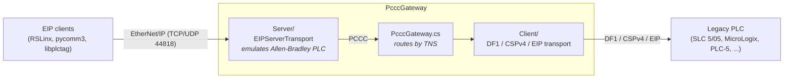

# PcccGateway

**Protocol Gateway for PCCC (Allen-Bradley)** — a modern, cross-platform, software-defined PCCC gateway that bridges EtherNet/IP clients to legacy PLCs via DF1 (serial), CSPv4 (TCP/2222), or EtherNet/IP. Designed for reliability, performance, and ease of deployment—beyond the original 1761-NET-ENI hardware bridge.

## Overview

PcccGateway acts as a **transparent protocol converter**:

- On the **EtherNet/IP side**, it behaves like a PLC (SLC 5/05 or MicroLogix 1400), accepting
  connections from RSLinx, libplctag, pycomm3, or any other EIP client.
- On the **PLC side**, it forwards PCCC commands to legacy hardware through:
  - **DF1 Full-Duplex** (RS-232, point-to-point)
  - **DF1 Half-Duplex Master** (RS-485, multi-drop)
  - **CSPv4** (TCP port 2222, PLC-5E / SLC 5/05)
  - **EtherNet/IP** (TCP port 44818 — for chaining to another EIP PLC or gateway)

The gateway **does not interpret** PCCC payloads—it just moves bytes between transports. This
means any EIP client can access older PLCs that only speak DF1 or CSPv4.

## Architecture



- `Server/EIPServerTransport.cs` — the frontend. TCP + UDP listener on 44818, RegisterSession,
  List Identity/Services/Interfaces, Forward Open/Close, connected & unconnected messaging, and
  the CIP Execute PCCC (0x4B) path. Answers broadcast ListIdentity so it appears in RSLinx
  "Browse Network" automatically.
- `Client/` — the PLC-side transports, all implementing `ITransport`:
  `DF1FullDuplexTransport` and `DF1HalfDuplexTransport` over `DF1BaseTransport`,
  `CSPTransport` and `EIPTransport` over `TCPBaseTransport`, plus `SerialPortWrapper`.
- `PcccGateway.cs` — the core `Gateway`: wires the server's `PduReceived` to the PLC transport's
  `SendFrame`, and the PLC transport's `FrameReceived` back to the originating client. It
  allocates a gateway-unique TNS per outstanding request and restores the client's original TNS
  on the reply, so a single PLC link can safely serve many clients.
- `Common/` — `Logger`, `RingBuffer`, `CheckSumOptions`.
- `Interface/` — `ITransport` (PLC-facing backend), `IServerTransport` (client-facing frontend),
  `ISerialPort`.

## Features

- ✅ Transparent PCCC forwarding — no address parsing, data conversion, or payload size opinions
- ✅ Full EIP server implementation (RegisterSession, ListIdentity, Forward Open, Connected/Unconnected Send)
- ✅ DF1 Full-Duplex (RS-232) with ACK/NAK, ENQ, CRC/BCC
- ✅ DF1 Half-Duplex Master (RS-485) with multi-drop addressing and echo suppression
- ✅ CSPv4 transport with **magic number `00 04 00 05`** (verified against PLC-5/40E hardware)
- ✅ EtherNet/IP backend for chaining to another EIP PLC or gateway
- ✅ Per-request TNS correlation — replies never cross between concurrent clients
- ✅ Multi-client support (up to 32 concurrent EIP clients)
- ✅ Auto-reconnect with exponential backoff on link failure
- ✅ Automatic PLC identity discovery (PLC-5, SLC, MicroLogix)
- ✅ Robust error recovery and graceful shutdown
- ✅ Diagnostic logging and health monitoring
- ✅ Cross-platform: Windows, Linux, macOS (.NET 8)

## Use Cases

- **libplctag** — use libplctag (which only speaks EIP) to access PLCs via DF1 or CSPv4
- **RSLinx** — browse and communicate with PLCs that are only reachable via serial or legacy Ethernet
- **pycomm3 / python** — any EIP client gains access to legacy hardware
- **Custom SCADA** — integrate DF1/CSPv4 PLCs into modern EIP-based systems
- **Concentrator/proxy** — funnel multiple EIP masters onto one PLC link, or place a logging
  point between clients and the PLC

## Requirements

- [.NET 8 SDK](https://dotnet.microsoft.com/download)
- A serial port (for DF1) or network access to the target PLC (for CSPv4 / EIP)

## Repository layout

```
PcccGateway/
├── PcccGateway.sln            solution (main project + tests)
├── src/PcccGateway/           the gateway (Client/ Common/ Interface/ Server/)
└── tests/PcccGateway.Tests/   xUnit unit tests (150+ tests)
```

## Building

```bash
dotnet build -c Release        # builds the whole solution
```

## Testing

```bash
dotnet test                    # runs the xUnit suite (no hardware required)
```

The test suite includes 150+ tests covering:
- DF1 full-duplex and half-duplex framing, checksum, ACK/NAK/ENQ, retry/backoff,
  timeout, echo suppression, partial frame timeout, buffer overflow, and shutdown
- DF1 callback re-entrancy — a handler may send from inside a receive callback, and may
  close the transport from one, without deadlocking
- EIP server boundary conditions and buffer overflow protection
- TCP transport session lifecycle: generation-guarded teardown, subscriber exception
  isolation, event ordering, Close/Dispose called from inside a handler, and the
  encapsulation size limits of each protocol
- SerialPortWrapper session lifecycle: chunk ordering, stale chunks dropped across a
  reopen, and teardown that cannot publish over a half-closed session
- Gateway TNS correlation and eviction
- Transport lifecycle (Open/Close/Open cycles) and reconnect behaviour
- Gateway end-to-end forwarding with TNS correlation (real TCP socket)
- Asynchronous logging with bounded queue and forced log behavior
- Identity resolver (PLC-5, SLC, MicroLogix), checksum, DLE stuffing, and ring buffer
- All tests are async (no xUnit1031 warnings) and run serially to avoid static Logger interference

## Running

The gateway is fully non-interactive — all settings come from the command line, so it can run
unattended as a service, container, or CI job. It always exposes an EtherNet/IP server (the
frontend) and forwards to the PLC through the transport selected with `--mode`.

```bash
# DF1 full-duplex serial (default mode)
dotnet run -c Release -- COM2 --baud 19200 --checksum crc

# DF1 half-duplex master (RS-485), slave node 3
dotnet run -c Release -- COM3 --mode df1master --target 3 --rs485-mode rts

# CSPv4 to a PLC over TCP
dotnet run -c Release -- --mode csp --host 192.168.1.10 --csp-port 2222

# EtherNet/IP to a PLC over TCP
dotnet run -c Release -- --mode eip --host 192.168.1.10
```

### Options

The **Applies to** column is enforced, not advisory: an option the selected `--mode` does not
read is rejected with an error rather than accepted and ignored. `--mode csp --baud 9600` does
not start. Invalid values are rejected too — a mistyped number no longer leaves the default
quietly in place.

| Option | Applies to | Description | Default |
|---|---|---|---|
| `[port]` | df1, df1master | Serial port (first bare argument) | `COM2` |
| `--mode <df1\|df1master\|csp\|eip>` | all | PLC-side transport | `df1` |
| `--baud <n>` | df1, df1master | Baud rate | `19200` |
| `--parity <none\|odd\|even>` | df1, df1master | Parity | `none` |
| `--checksum <crc\|bcc>` | df1, df1master | DF1 checksum | `crc` |
| `--target <1-254>` | df1master | Slave node address | `1` |
| `--rs485-mode <auto\|rts\|dtr>` | df1master | RS-485 direction control | `auto` |
| `--rs485-assert-delay <ms>` | df1master | Delay after enabling driver | `1` |
| `--rs485-deassert-delay <ms>` | df1master | Delay before disabling driver | `5` |
| `--echo-suppression` | df1master | Discard echoed bytes on RS-485 | off |
| `--host <ip>` | csp, eip | PLC IP address (required) | — |
| `--csp-port <n>` | csp | PLC CSP port | `2222` |
| `--plc-eip-port <n>` | eip | PLC EtherNet/IP port | `44818` |
| `--lsap-control <hex>` | csp | CSP LSAP control byte | `00` |
| `--listen-port <n>` | all | EIP **server** listen port (frontend) | `44818` |
| `--bind <ip>` | all | Bind EIP server to one interface (may disable RSLinx broadcast browse) | all interfaces |
| `--quiet`, `-q` | all | Disable logging for max performance | off |
| `--help`, `-h` | — | Show usage | — |

Point your EIP client at the machine running the gateway (e.g. add its IP in RSLinx, or use
`pycomm3.SLCDriver('<gateway-ip>')`). Stop the gateway with Ctrl+C.

## Configuration notes

- **DF1 checksum** — CRC-16 (default) or BCC, via `--checksum`.
- **DF1 half-duplex** — set the slave node with `--target` (1–254); the gateway writes it into
  the command frame's DST byte automatically. RS-485 direction control is `--rs485-mode`
  `auto` / `rts` / `dtr`, with configurable assert/deassert timing and optional echo
  suppression for adapters that loop TX back onto RX.
- **CSPv4** — the LSAP control byte defaults to `0x00`; some targets (e.g. certain RSLinx
  configurations) expect `0x05`. Set it with `--lsap-control 05`.
- **Logging cost** — `--quiet` is not a minor optimisation. Diagnostic logging formats and
  writes a line per PDU, which dominates throughput for clients that issue many small
  requests. Leave it on while commissioning, turn it off in production.
- **Shutdown** — Ctrl+C drains the transports fully. SIGTERM and `docker stop` run under the
  runtime's ProcessExit budget of roughly two seconds, which may cut that drain short. The
  drains are best-effort, so nothing is corrupted either way.

## Status & limitations

Verified against RSLinx OPC Server and PCCCEmulator for read/write (int, float, string, bit),
multi-element, mode switching, memory init, and read-modify-write. RSLinx Browse and Data
Monitor exercise the ListIdentity, Forward Open, Connected Send and Forward Close paths.

Cross-checked against **libplctag** reading the same 523-tag address list through each PLC-side
transport in turn — DF1, CSPv4 and EtherNet/IP — with identical values in all three. That the
result does not depend on which backend carried it is the practical test of the transparency
claim above.

- **Routed LSAP (DH+ / DH-485) is not implemented** — only the local/direct form is supported.
  Deployments that bridge onto a DH+ or DH-485 segment are out of scope for now.
- **Get Attribute Single** on the Identity Object answers CIP status 0x08 (service not
  supported). Clients use Get Attributes All, which is implemented.
- **RS-485 de-assert timing** is a heuristic derived from baud rate and frame length. It has
  only ever run against virtual serial ports, where RTS does nothing. Validate it on the real
  adapter before trusting it, and raise `--rs485-deassert-delay` if frames come back truncated.

## License

GNU Lesser General Public License v3.0 or later (LGPL-3.0-or-later).

Copyright (c) 2026 Ketut Kumajaya.
